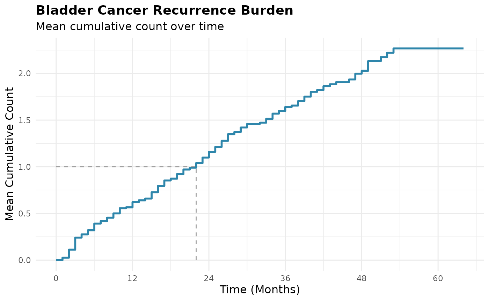
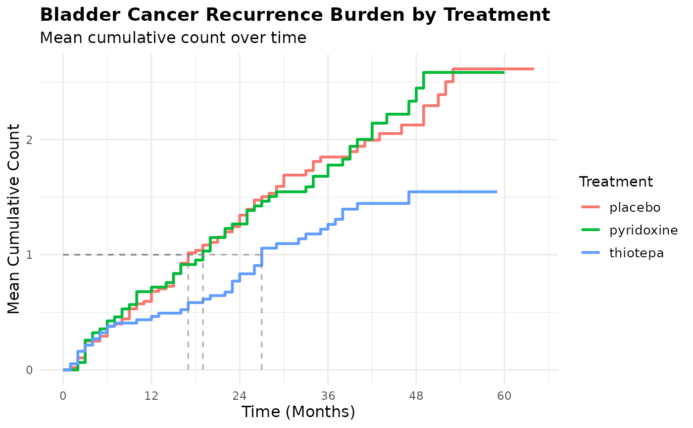

# Introduction to mccount

## Introduction

When studying diseases and medical interventions, patients often
experience events that can occur multiple times (e.g., hospitalizations,
infections, or tumor recurrences). Traditional survival analysis methods
typically focus on time to the *first* event, potentially missing
important information about the total disease burden.

Many patients experience events that can occur multiple times—like
hospital readmissions, infections, or tumor recurrences. Traditional
survival analysis is only concerned with the first event and does not
account for competing risks like death. Alternatively, the mean
cumulative count (MCC) provides a more complete picture by estimating
the expected number of events per person by a given time, properly
accounting for:

- Multiple occurrences of the same event (recurrent events)
- Events that prevent future occurrences (competing risks like death)
- Incomplete follow-up (censoring)

``` r
library(mccount)
library(dplyr)
library(survival)
```

## Clinical Example: Bladder Cancer Recurrences

We’ll use the
[`survival::bladder1`](https://rdrr.io/pkg/survival/man/bladder.html)
dataset from the [survival](https://github.com/therneau/survival)
package, which contains data on bladder cancer recurrences from a
randomized trial comparing three treatments: `placebo`, `pyridoxine`,
and `thiotepa`.

The `bladder1` dataset contains 118 patients followed for tumor
recurrences. The key variables are:

- `id`: Patient identifier
- `stop`: Time of event or censoring
- `status`: Event type (0 = censored, 1 = recurrence, 2 = death from
  bladder disease, 3 = death from other cause)
- `treatment`: Treatment group (placebo, pyridoxine, or thiotepa)

## Data Preparation

For MCC analysis, we need to ensure our competing event variable has the
proper coding:

- `0` = censoring
- `1` = event of interest (recurrence)
- `2` = competing event (death from any cause)

``` r
# Prepare data for MCC analysis
bladder_mcc <- bladder1 |>
  # Combine death causes into a single competing event indicator
  mutate(status = if_else(status >= 2, 2, status))
```

## Basic MCC Analysis

Let’s calculate the MCC of bladder cancer recurrences for the entire
cohort:

``` r
# Calculate MCC using the Dong-Yasui equation method
mcc_overall <- mcc(
  data = bladder_mcc,
  id_var = "id",
  time_var = "stop",
  cause_var = "status"
)
#> Warning: Found 13 participants where last observation is an event of interest
#> (`cause_var` = 1)
#> First 5 IDs: 13, 15, 16, 19, 24
#> Total affected: 13 participants
#> ℹ `mcc()` assumes these participants are censored at their final `time_var`
#> ℹ If participants were actually censored or experienced competing risks after
#>   their last event, add those observations to ensure correct estimates
```

Notice that
[`mcc()`](https://kennethataylor.github.io/mccount/reference/mcc.md)
will warn the user if there are participants whose data end do not
explicitly have a censoring event (`0`) of competing event (`2`) on
their final row. The function provides this warning to ensure the user
is aware of this and also aware of how this is implicitly interpreted by
the package. The function also lets the user know that the MCC estimate
will be incorrect if the `mccount`’s implicit assumption is incorrect.

### Available Estimators

The [`mcc()`](https://kennethataylor.github.io/mccount/reference/mcc.md)
function can be used to calculate the MCC using either the Dong-Yasui
estimator (`method = "equation"`, the default) or the sum of cumulative
incidence estimator (`method = "sci"`). See
[`vignette("choosing-between-methods")`](https://kennethataylor.github.io/mccount/articles/choosing-between-methods.md)
and [`?mcc`](https://kennethataylor.github.io/mccount/reference/mcc.md)
for more details.

### Understanding the Output

Just calling the `mcc` object we’ve created will print the method used,
a preview of the MCC estimates at each time point, and the exact
[`mcc()`](https://kennethataylor.github.io/mccount/reference/mcc.md)
call used to generate the output:

``` r
mcc_overall
#> 
#> ── Mean Cumulative Count Results ───────────────────────────────────────────────
#> ℹ Method: Dong-Yasui Equation Method
#> 
#> ── MCC Estimates ──
#> 
#> # A tibble: 6 × 2
#>    time    mcc
#>   <int>  <dbl>
#> 1     0 0     
#> 2     1 0.0256
#> 3     2 0.112 
#> 4     3 0.241 
#> 5     4 0.276 
#> 6     5 0.320
#> # ... with 45 more rows
#> ── Call ──
#> 
#> mcc(data = bladder_mcc, id_var = "id", time_var = "stop", cause_var = "status")
```

The package also includes an S3 method for the
[`summary()`](https://rdrr.io/r/base/summary.html) function that will
output more useful details:

``` r
# Get summary statistics
summary(mcc_overall)
#> 
#> ── Summary of Mean Cumulative Count Results ────────────────────────────────────
#> ℹ Method: Dong-Yasui Equation Method
#> ℹ Total participants: 118
#> 
#> ── Summary Statistics ──
#> 
#> Observation period: [0, 64]
#> Time to MCC = 1.0: 22
#> Time to maximum MCC: 53
#> MCC at end of follow-up: 2.2672
#> 
#> ── Event Count Composition
#> Events of interest: 189
#> Competing risk events: 29
#> Censoring events: 76
```

We can also extract the MCC estimate at the end of study follow-up using
`mcc_final_values(mcc_overall)` and/or extract the MCC values at
specific time points (not only the MCC at the end of follow-up). For
example:

``` r
# Extract key timepoints
key_times <- c(6, 12, 24, 36, 48, 60)  # months
mcc_at_times <- mcc_overall$mcc_table |>
  filter(time %in% key_times) |>
  mutate(
    years = time / 12,
    mcc = cards::round5(mcc, 3)
  ) |>
  select(years, time, mcc)

mcc_at_times
#> # A tibble: 6 × 3
#>   years  time   mcc
#>   <dbl> <int> <dbl>
#> 1   0.5     6 0.391
#> 2   1      12 0.622
#> 3   2      24 1.16 
#> 4   3      36 1.64 
#> 5   4      48 2.03 
#> 6   5      60 2.27
```

### Visualization

`mccount` provides flexible plotting capabilities that can be combined
with `ggplot2` functions/syntax:

``` r
# Basic plot
plot(mcc_overall) +
  labs(
    title = "Bladder Cancer Recurrence Burden",
    subtitle = "Mean cumulative count over time",
    x = "Time (Months)"
  ) +
  scale_x_continuous(
    breaks = c(seq(
      0, max(mcc_overall$mcc_table$time), 
      by = 12
      )
    )) +
    geom_line_mcc(mcc_overall)
```



The step function shows how the expected number of bladder cancer
recurrences accumulates over the entire study follow-up period.

## MCC Interpretation

The estimated MCC can be interpreted as the number of events per person
we expect among individuals who have not experienced a competing risk
event by a given time. Looking at the print out from
`summary(mcc_overall)`, the MCC at the end of follow-up is 2.27 - on
average, each bladder cancer survivor experiences 2.27 recurrences by 64
months.

In a population of 100 similar patients, we expect approximately
`2.27 * 100 = 227` total recurrences by 64 months. This accounts for the
fact that some patients die and cannot experience further recurrences.

Dong, *et al*.[¹](#fn1) provide additional guidance for interpreting the
MCC (emphasis added):

> Note that MCC is a marginal measure (as opposed to a conditional
> measure) of disease burden, similar to \[cumulative incidence\], and
> its interpretation is *not* conditional on survival free of competing
> risk events. Also, MCC does *not* assume independence between the
> event of interest and the competing-risk event.

## Stratifying by Treatment Groups

It’s common that we may want to estimate the MCC stratified by a
specific characteristic, like `"treatment"` group.
[`mcc()`](https://kennethataylor.github.io/mccount/reference/mcc.md)
provides a simple `by` argument to assist with this:

``` r
# Calculate MCC by treatment group
mcc_by_treatment <- mcc(
  data = bladder_mcc,
  id_var = "id",
  time_var = "stop",
  cause_var = "status",
  by = "treatment",
  method = "equation"
)
#> Warning: Found 7 participants where last observation is an event of interest
#> (`cause_var` = 1)
#> First 5 IDs: 13, 15, 16, 19, 24
#> Total affected: 7 participants
#> ℹ `mcc()` assumes these participants are censored at their final `time_var`
#> ℹ If participants were actually censored or experienced competing risks after
#>   their last event, add those observations to ensure correct estimates
#> Warning: Found 4 participants where last observation is an event of interest
#> (`cause_var` = 1)
#> ! ID: 51, 64, 67, 70
#> ℹ `mcc()` assumes these participants are censored at their final `time_var`
#> ℹ If participants were actually censored or experienced competing risks after
#>   their last event, add those observations to ensure correct estimates
#> Warning: Found 2 participants where last observation is an event of interest
#> (`cause_var` = 1)
#> ! ID: 83, 104
#> ℹ `mcc()` assumes these participants are censored at their final `time_var`
#> ℹ If participants were actually censored or experienced competing risks after
#>   their last event, add those observations to ensure correct estimates

# Summary by group
summary(mcc_by_treatment)
#> 
#> ── Summary of Mean Cumulative Count Results ────────────────────────────────────
#> ℹ Method: Dong-Yasui Equation Method
#> ℹ Total participants: 118
#> ℹ Overall observation period: [0, 64]
#> 
#> ── Summary by Group (treatment) ──
#> 
#> ── Group: placebo
#> Participants in group: 48
#> Group observation period: [0, 64]
#> Time to MCC = 1.0: 17
#> Time to maximum MCC: 53
#> MCC at end of follow-up: 2.6137
#> Events of interest: 87
#> Competing risk events: 11
#> Censoring events: 30
#> 
#> ── Group: pyridoxine
#> Participants in group: 32
#> Group observation period: [0, 60]
#> Time to MCC = 1.0: 19
#> Time to maximum MCC: 49
#> MCC at end of follow-up: 2.5831
#> Events of interest: 57
#> Competing risk events: 7
#> Censoring events: 21
#> 
#> ── Group: thiotepa
#> Participants in group: 38
#> Group observation period: [0, 59]
#> Time to MCC = 1.0: 27
#> Time to maximum MCC: 47
#> MCC at end of follow-up: 1.5463
#> Events of interest: 45
#> Competing risk events: 11
#> Censoring events: 25
```

### Visualizing Treatment Differences

The other functions in `mccount` automatically recognize the
`mcc_grouped` S3 class and adjust their behavior accordingly. For
example, we can feed `mcc_by_treatment` into
[`plot()`](https://rdrr.io/r/graphics/plot.default.html), and it
automatically knows to plot an MCC curve by the stratification variable.

``` r
# Plot with treatment groups
plot(mcc_by_treatment) +
  labs(
    title = "Bladder Cancer Recurrence Burden by Treatment",
    subtitle = "Mean cumulative count over time",
    x = "Time (Months)",
    color = "Treatment"
  ) +
  scale_x_continuous(
    breaks = seq(
      0, max(mcc_by_treatment$original_data$time), 
      by = 12
      )
    ) +
    geom_line_mcc(mcc_by_treatment)
```



Confidence intervals for the MCC can be generated via bootstrapping.

## Weighted MCC Analysis

`mccount` also allows estimation of weighted MCC in the setting of
observational studies that want to account for measured confounding
and/or other types of bias via matching or weighting. See the
[`vignette("estimating-mcc-after-matching-or-weighting")`](https://kennethataylor.github.io/mccount/articles/estimating-mcc-after-matching-or-weighting.md)
for more details.

------------------------------------------------------------------------

1.  Dong H, Robison LL, Leisenring WM, Martin LJ, Armstrong GT, Yasui Y.
    Estimating the burden of recurrent events in the presence of
    competing risks: the method of mean cumulative count. *Am J
    Epidemiol*. 2015 Apr 1;181(7):532-40. doi:
    [10.1093/aje/kwu289](https://doi.org/10.1093/aje/kwu289)
